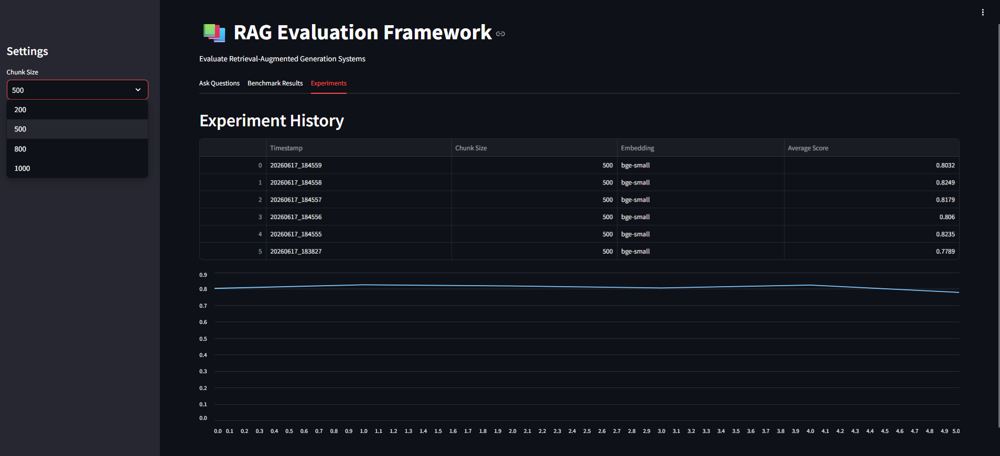
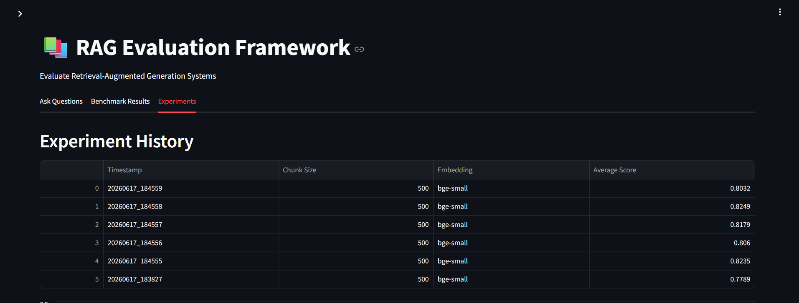

# 📚 RAG Evaluation Framework

A Retrieval-Augmented Generation (RAG) Evaluation Framework built using ChromaDB, BGE embeddings, Groq Llama 3.1, and Streamlit.

The project enables document ingestion, semantic retrieval, answer generation, benchmark evaluation, and experiment tracking through an interactive dashboard.

---

## 🚀 Features

* PDF ingestion and processing
* Text chunking for document retrieval
* BGE-small embedding generation
* ChromaDB vector storage
* Semantic retrieval
* Llama 3.1 answer generation using Groq API
* Benchmark dataset evaluation
* Similarity-based answer scoring
* Experiment tracking and result storage
* Interactive Streamlit dashboard

---

## 📸 Screenshots

### Dashboard Home



### Benchmark Results


### Experiment History



---


## 🏗️ Architecture

```text
PDF Document
      ↓
PDF Loader
      ↓
Chunking
      ↓
BGE Embeddings
      ↓
ChromaDB
      ↓
Retriever
      ↓
Llama 3.1 (Groq)
      ↓
Generated Answer
      ↓
Similarity Evaluation
      ↓
Experiment Tracker
      ↓
Streamlit Dashboard
```

---

## 🛠️ Tech Stack

* Python
* Streamlit
* ChromaDB
* Sentence Transformers
* Groq API
* Pandas
* NumPy

---

## 📂 Project Structure

```text
RAG Evaluation Framework
│
├── chunking/
├── embeddings/
├── evaluation/
├── generation/
├── retrieval/
├── vector_store/
├── data/
├── experiments/
├── app.py
├── main.py
├── requirements.txt
└── README.md
```

---

## 📊 Evaluation Pipeline

The framework evaluates RAG performance using:

* Benchmark Questions
* Ground Truth Answers
* Similarity-Based Scoring
* Experiment Tracking

Example Metrics:

| Question | Score |
| -------- | ----- |
| Q1       | 0.82  |
| Q2       | 0.83  |
| Q3       | 0.66  |
| Q4       | 0.84  |
| Q5       | 0.73  |

Average Score: **0.7789**

---

## 🌐 Streamlit Dashboard

The dashboard includes:

### Ask Questions

* Query the uploaded knowledge base
* View generated answers
* Inspect retrieved chunks

### Benchmark Results

* View evaluation scores
* Monitor average performance

### Experiment History

* Track previous benchmark runs
* Compare configurations

---

## ▶️ Installation

Clone the repository:

```bash
git clone https://github.com/29ananyaseth/RAG-evaluation-framework.git
cd RAG-evaluation-framework
```

Install dependencies:

```bash
pip install -r requirements.txt
```

Create a `.env` file:

```env
GROQ_API_KEY=your_api_key
```

Run the dashboard:

```bash
streamlit run app.py
```

---

## 🔮 Future Improvements

* RAGAS Metrics Integration
* Embedding Model Comparison
* Chunk Size Benchmarking
* Advanced Visualization Dashboard
* Multi-PDF Evaluation

---
